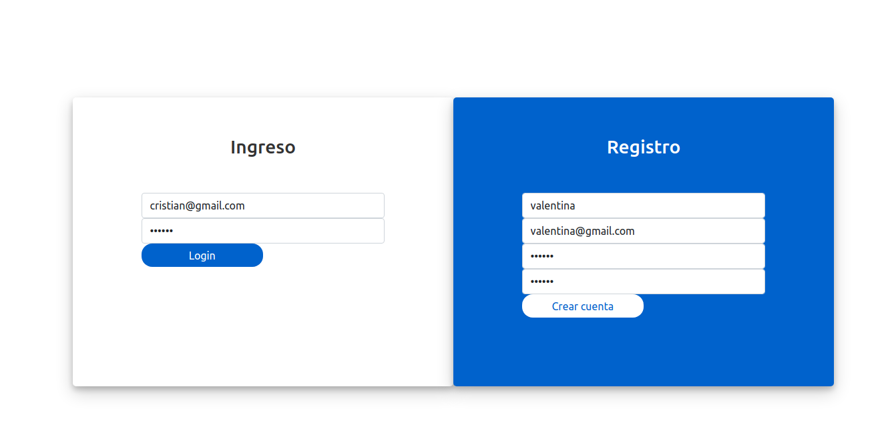
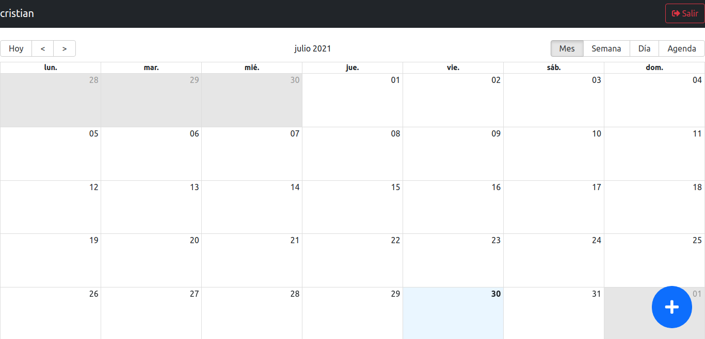
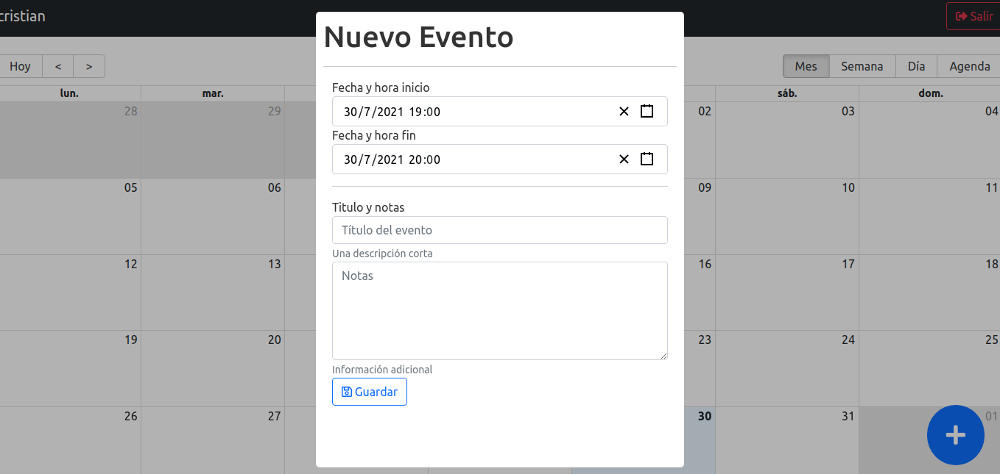
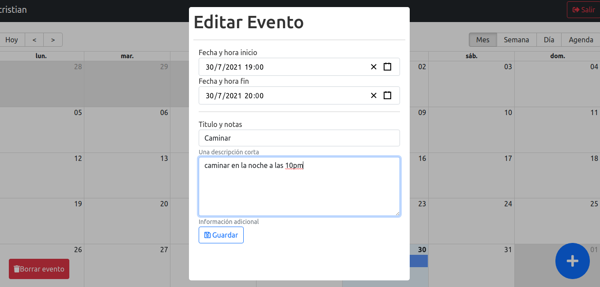

# Proyecto Calendar APP

  

  

  

  

#### Tecnologías necesarias:
- [ ] React
- [ ] Redux
- [ ] Express
- [ ] Node JS
- [ ] Express JS
- [ ] JWT - para la parte de la Autenticación
- [ ] MongoDB